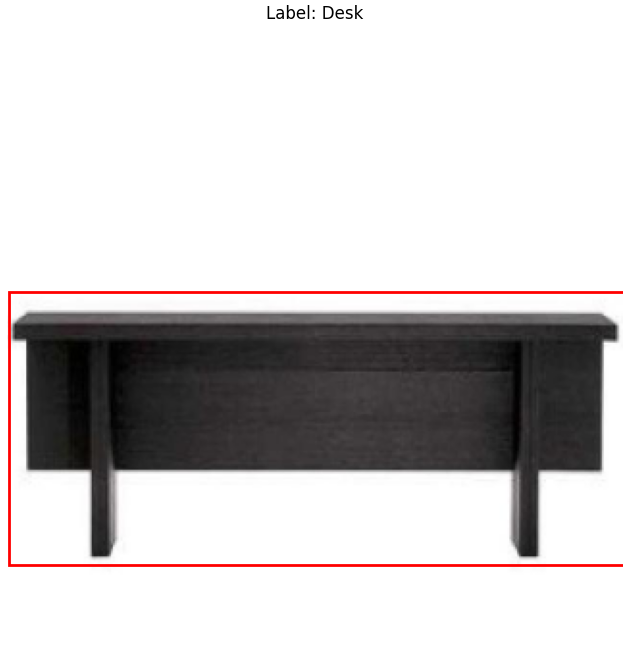
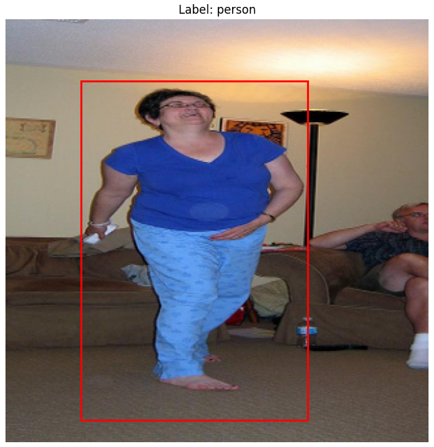
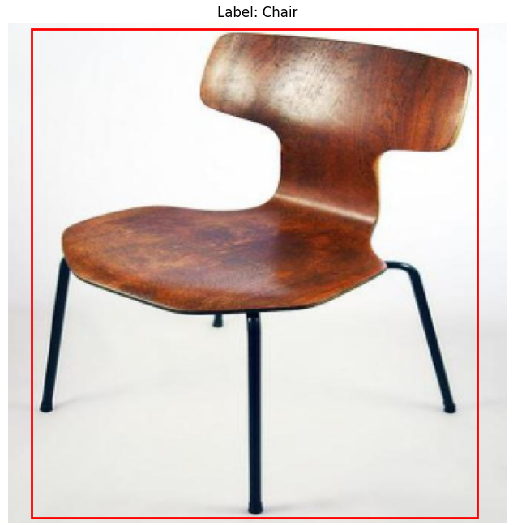
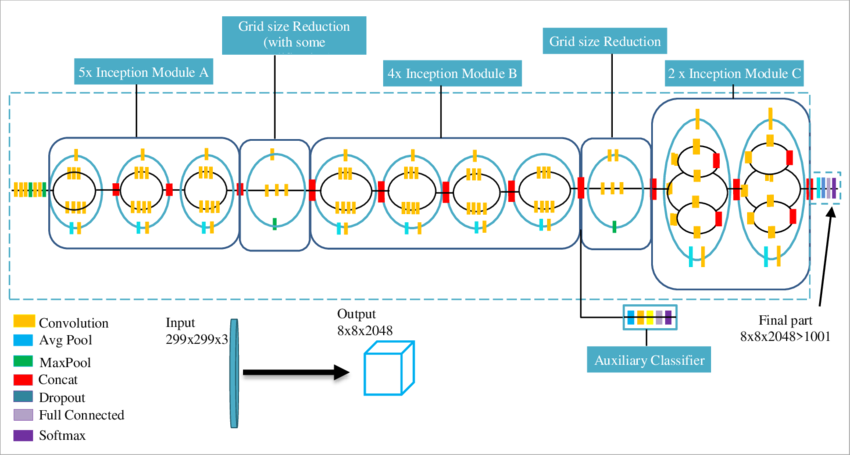
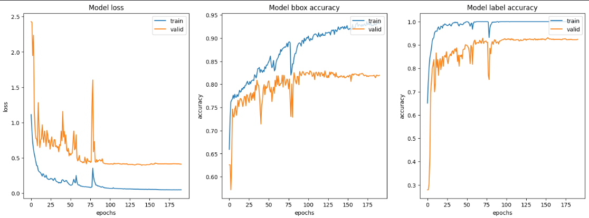
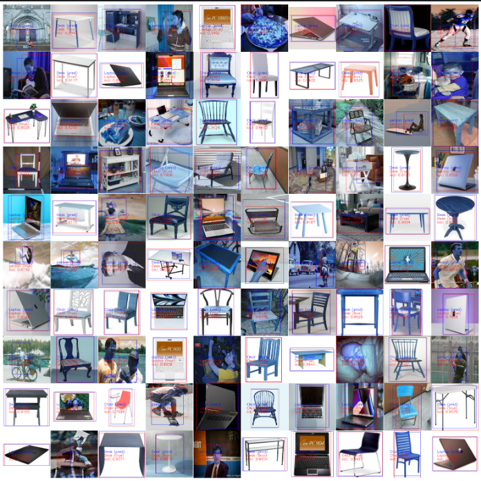

# Object Localization and Classification in classroom with InceptionV3 model

## Demonstration

Firstly, I introduced demo app for having an overview about this project. Here is a quick demonstration of the application in action:


## Project Description
This project focuses on object localization and classification in images using TensorFlow and OpenCV. It leverages the powerful deep learning capabilities of TensorFlow to train models on annotated datasets and OpenCV for image processing tasks. The goal is to accurately identify and classify objects within a variety of image contexts.

## Example images after processing data with truth label and bouding box 
<p align="center">
  
  
  
</p>


## Features
- Use of TensorFlow for model training and inference.
- Image processing and manipulation with OpenCV.
- Evaluation of model accuracy and performance metrics.
- Visualization of localization results.

## Model


## Prerequisites
Before you begin, ensure you have the following installed:
- Python 3.8 or higher
- pip (Python package installer)

## Example
You can run example notebook from `/notebooks/example.ipynb` to train model easier

## Data

The data used in this project were meticulously collected from Classroom Objects and processed by our team. We gathered images through photography and manually annotated each image with labels and bounding boxes to ensure high-quality training data for our model. This dataset is essential for the precision and effectiveness of the object localization and classification tasks.

If you wish to access the dataset, please visit the following Google Drive link:
[Access Dataset](https://drive.google.com/drive/folders/17gH7V77CQ9TP8NqOSK9iToDXGio-ErwW?usp=sharing)

Please note that the data is provided for academic and non-commercial use only.

## Training Chart
<p align="center">
  
</p>

## Results
**After training the model, we had a result with Mean IoU: 0.7363 - Acc: 0.9362**

<p align="center">
  
</p>

## Installation

### Setting Up a Virtual Environment
It is recommended to use a virtual environment to avoid conflicts with existing Python packages from `requirements.txt`.

## Citation

If you utilize the Inception v3 model in your project, please consider citing the original paper. Here is the citation in APA format:

Szegedy, C., Vanhoucke, V., Ioffe, S., Shlens, J., & Wojna, Z. (2016). Rethinking the Inception Architecture for Computer Vision. Proceedings of the IEEE Conference on Computer Vision and Pattern Recognition (CVPR), 2818-2826.

For BibTeX users:

```bibtex
@inproceedings{szegedy2016rethinking,
  title={Rethinking the Inception Architecture for Computer Vision},
  author={Szegedy, Christian and Vanhoucke, Vincent and Ioffe, Sergey and Shlens, Jonathon and Wojna, Zbigniew},
  booktitle={Proceedings of the IEEE conference on computer vision and pattern recognition},
  pages={2818--2826},
  year={2016}
}


